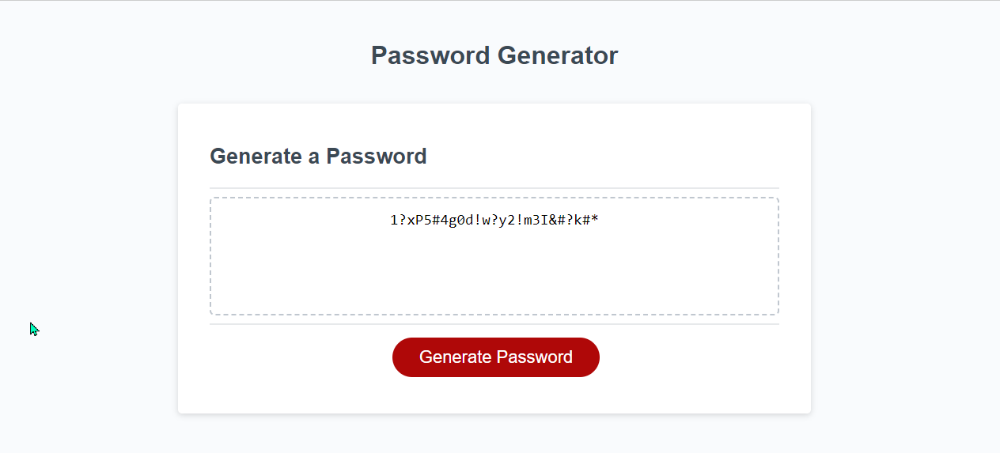

# <a href="https://jjohnson673.github.io/Password-Generator/" target="_blank">Creating a Password Generator</a>

## Description

This main webpage was designed as a part of a Challenge for Module 2. Creating a password generator allowed to use recent knowledge gained with JavaScript. I was able to see where I went wrong with a lot of my coding by using console.log and seeing how it was being logged through the Dev Tools. This allowed me to make minor adjustments until I was able to locate exactly where I went wrong and how to correct my path.

## Installation

N/A

## Usage

Within this page you will be able to find multiple boolean variables, a full loop with break and If/Else statements. By implementing these statements, I was able to determine which items a user would want to have within their generated password. The loop  and loop break was implemented to allow the user to exit out of the initial window prompt and to allow the user to be able to loop back to the main question without needing to leave the page to restart.

## Credits

N/A

## License

N/A
